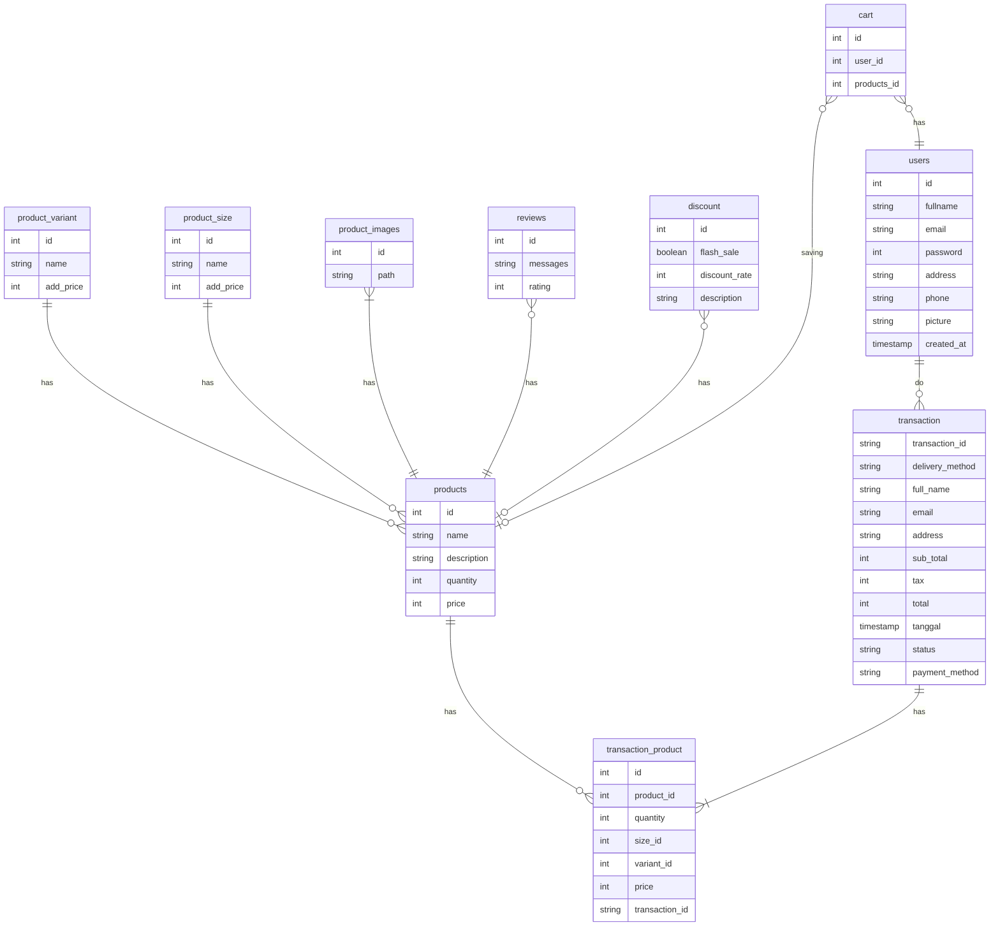
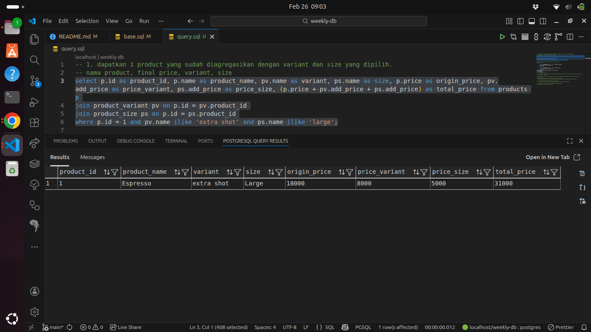

# Membuat ERD, DDL, dan DML dari Mockup Project Coffee Shop

## ERD

```mermaid
    erDiagram

    users ||--o{ transaction : do
    users {
        int id
        string fullname
        string email
        int password
        string address
        string phone
        string picture
        timestamp created_at
    }

    products ||--o{ transaction_product : has
    products {
        int id
        string name
        string description
        int quantity
        int price
    }
    product_variant ||--o{ products : has
    product_variant {
        int id
        string name
        int add_price
    }

    product_size ||--o{ products : has
    product_size {
        int id
        string name
        int add_price
    }

    product_images }|--|| products : has
    product_images {
        int id
        string path
    }

    reviews }o--|| products : has
    reviews {
        int id
        string messages
        int rating
    }

    transaction ||--|{ transaction_product : has
    transaction {
        string transaction_id
        string delivery_method
        string full_name
        string email
        string address
        int sub_total
        int tax
        int total
        timestamp tanggal
        string status
        string payment_method
    }

    transaction_product {
        int id
        int product_id
        int quantity
        int size_id
        int variant_id
        int price
        string transaction_id
    }

    discount }o--o| products : has
    discount {
        int id
        boolean flash_sale
        int discount_rate
        string description
    }

    cart }o--|| users : has
    cart }o--o| products : saving
    cart {
        int id
        int user_id
        int products_id
    }

```

## Minitask query.sql
### Menampilkan 1 data product dengan kolom : nama product, variant, size, total price

###