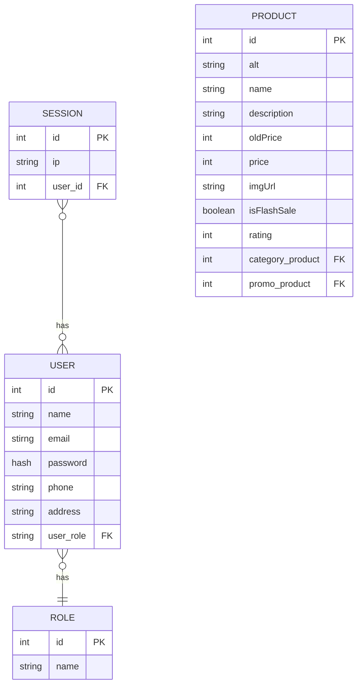

```mermaid
    erDiagram

    USER }o--|| ROLE : has
    USER {
        int id PK
        string name
        stirng email
        hash password
        string phone
        string address
        string user_role FK
    }

    ROLE {
        int id PK
        string name
    }

    SESSION }o--o{ USER : has
    SESSION {
        int id PK
        string ip
        int user_id FK
    }

    PRODUCT {
        int id PK
        string alt
        string name
        string description
        int oldPrice
        int price
        string imgUrl
        boolean isFlashSale
        int rating
        int category_product FK
        int promo_product FK
    }

```