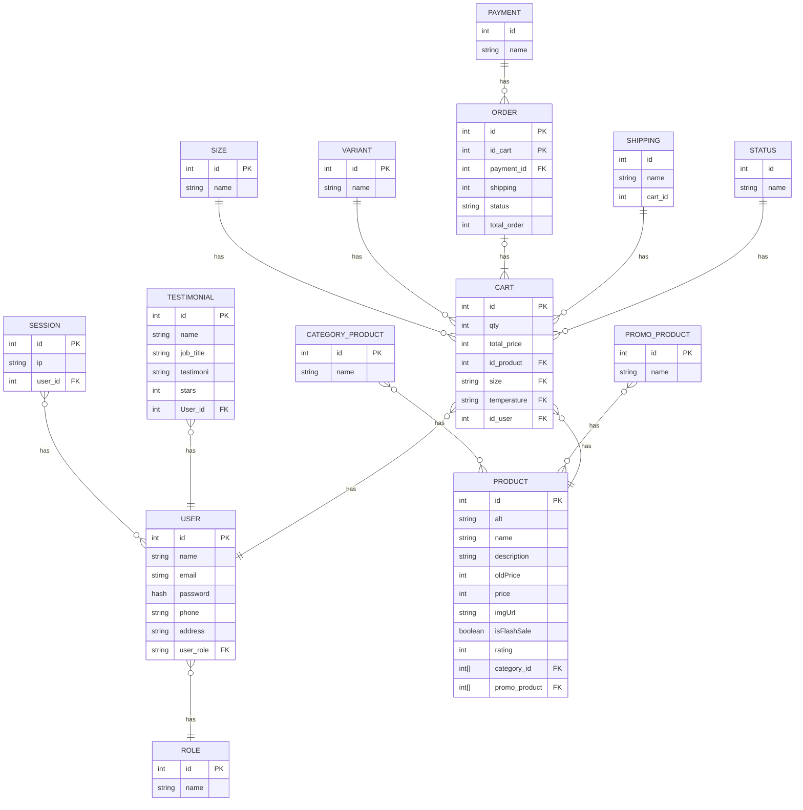

```mermaid
    erDiagram

    USER }o--|| ROLE : has
    USER {
        int id PK
        string name
        stirng email
        hash password
        string phone
        string address
        string user_role FK
    }

    ROLE {
        int id PK
        string name
    }

    SESSION }o--o{ USER : has
    SESSION {
        int id PK
        string ip
        int user_id FK
    }

    PRODUCT {
        int id PK
        string alt
        string name
        string description
        int oldPrice
        int price
        string imgUrl
        boolean isFlashSale
        int rating
        int[] category_id FK
        int[] promo_product FK
    }

    CATEGORY_PRODUCT }o--o{ PRODUCT : has
    CATEGORY_PRODUCT {
        int id PK
        string name
    }

    PROMO_PRODUCT }o--o{ PRODUCT : has
    PROMO_PRODUCT {
        int id PK
        string name
    }

    TESTIMONIAL }o--|| USER : has
    TESTIMONIAL {
        int id PK
        string name
        string job_title
        string testimoni
        int stars
        int User_id FK
    }

    CART }o--|| PRODUCT : has
    CART }o--|| USER : has
    CART {
        int id PK
        int qty
        int total_price
        int id_product FK
        string size FK
        string temperature FK
        int id_user FK
    }

    SIZE ||--o{ CART : has
    SIZE {
        int id PK
        string name
    }

    VARIANT ||--o{ CART : has
    VARIANT {
        int id PK
        string name
    }

    ORDER |o--|{ CART : has
    ORDER {
        int id PK
        int id_cart PK
        int payment_id FK
        int shipping
        string status
        int total_order
    }

    PAYMENT ||--o{ ORDER : has
    PAYMENT {
        int id
        string name
    }

    SHIPPING ||--o{ CART : has
    SHIPPING {
        int id
        string name
        int cart_id
    }

    STATUS ||--o{ CART : has
    STATUS {
        int id
        string name
    }

```